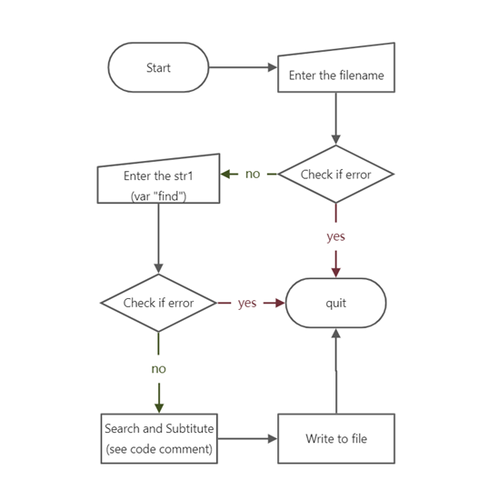
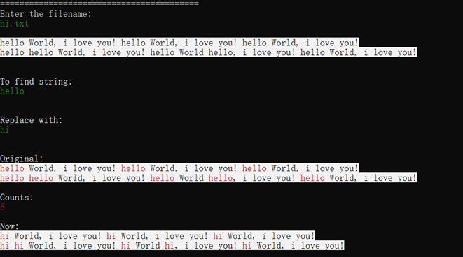
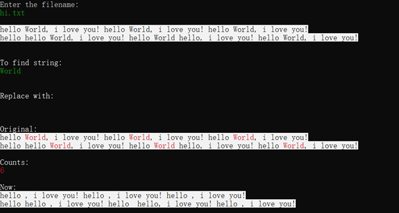
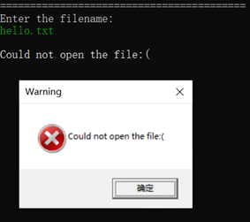
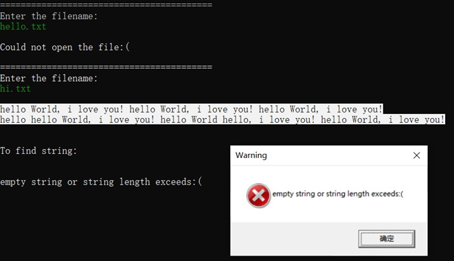
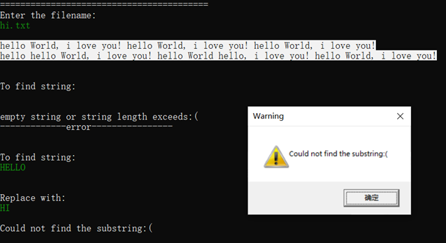

[English](README_en.md) | 简体中文

# 文本文件的数据查找和替换

## 课题内容

利用 PC 系统机资源，采用汇编语言的程序设计，实现查找文本文件中的指定字符串。

### 基本要求

(1)设计一个操作界面，显示提示操作，可输入文件名，输入所查找的字符串等；
(2)显示其文本文件的内容、用不同颜色或闪烁标示出所找到的字符或字符串；
(3)显示出查找到的数目；

### 提高要求

(1)美观的图形界面设计，人机交互友好；
(2)实现字符串替换功能，将查找到的字符串以用户指定的字符串替换，并保存；

## 主要变量及数据结构

|     变量名                   |     类型      |     变量值                           |     注释                                           |
|------------------------------|---------------|--------------------------------------|----------------------------------------------------|
|     handle_file              |     handle    |     ?                                |                                                    |
|     str_filename_original    |     byte      |     FILENAME_BUFFER_SIZE   DUP(0)    |                                                    |
|     str_filename_result      |     byte      |     "result.txt",0                   |                                                    |
|     original                 |     byte      |     CONTENT_BUFFER_SIZE   DUP(0)     |     原文件中的字符串                               |
|     str_find                 |     byte      |     CONTENT_BUFFER_SIZE DUP(0)       |     查找的字符串                                   |
|     str_replace              |     byte      |     CONTENT_BUFFER_SIZE   DUP(0)     |     需要替换的字符串                               |
|     result                   |     byte      |     CONTENT_BUFFER_SIZE DUP(0)       |     最终新文件中的字符串                           |
|     set_pos_ori              |     dword     |     CONTENT_BUFFER_SIZE   DUP(0)     |     数组，记录每个 “find” 字符串的起始位置         |
|     set_pos_res              |     dword     |     CONTENT_BUFFER_SIZE DUP(0)       |     数组，记录每个 “replace” 字符串的起始位置      |
|     pos1                     |     dword     |     0                                |     跟踪变量 I 并将符合要求的值交给 set_pos_ori    |
|     pos2                     |     dword     |     0                                |     跟踪变量 J 并将符合要求的值交给 set_pos_res    |
|     count_filename           |     dword     |     ?                                |     统计文件名的长度                               |
|     count_original           |     dword     |     ?                                |     统计文件中字符串长度                           |
|     count_find               |     dword     |     ?                                |     统计需要查找的字符串长度                       |
|     count_replace            |     dword     |     ?                                |     统计需要替换的字符串长度                       |
|     count_result             |     dword     |     ?                                |     统计新文件中字符串长度                         |
|     count                    |     dword     |     0                                |     统计查到的目标字符串个数                       |
|     i                        |     dword     |     ?                                |     ;INDEX FOR "ORIGINAL".                         |
|     j                        |     dword     |     ?                                |     ;INDEX FOR "RESULT".                           |

## 主要算法流程

本项目关键在于字符串查找算法的实现。

### 文件读写

通过调用 Win32 API 函数 CreateFile、ReadFile、WriteFile、CloseFile 实现。

### 字符串查找算法的实现

为了方便查找，我们需要一个“指针”从串变量的开始逐字符查询。我们对比变量 original 和 find 各自指针指向的字符，若相等，则同时向后移动一位；若不相等，则 original 的指针继续前进，find 的指针回到起始位置。在整个过程中，每次移动指针，我们需要检查指针是否指向了变量 original 或 find 的最后一位。

### 字符串替换算法的实现

为实现提高要求中的字符串替换，最好的做法就是在查找字符串的时候完成字符串的替换。具体做法是：

1. 每次查找到目标字串后，将遍历指针移动回目标字串的开头，根据替换字串的长度向变量 result 中写入替换字串；
2. 当所查字符非目标字串，则将遍历指针指向变量 original 中的字符复制到变量 result 中。

### 目标字符串高亮的代码实现

由于提高要求中还有高亮需求，因此需要构造数组变量 set_pos_ori 和 set_pos_res 存放目标字符串的位置（如首字符）。最终文件保存后，通过逐字符打印的方式输出，当打印到目标串的位置时，通过 Irvine 链接库定义的函数 SetTextColor 修改打印文本的颜色。

## 开发工具配置

Visual Studio 2019

主要使用的函数库：链接库 `Irvine32.inc`、控制台函数 `Win32 API`

Visual Studio 配置以支持汇编：

1. 配置 `VC++目录` 、`链接器 -> 常规`、`Microsoft Macro Assember` 的 `附加库目录`，添加 `Irvine` 文件夹。[参考链接](http://t.csdn.cn/cagve)
2. 配置`链接器 -> 输入` 的 `附加依赖项`，添加 `Irvine` 文件夹中对应的 .lib 文件。
3. `解决方案资源管理器 -> 项目` 右键菜单（项目标题处点击鼠标右键） -> 生成依赖项 -> 生成自定义文件 -> 勾选 MASM
4. 汇编代码高亮辅助插件（可选）：AsmDude

注1：AsmDude 可能无法识别到 `Irvine` 文件夹下的链接库，会在函数下方标红警告，但这不影响正常编译，消去警告的方法是把引用到的链接库 `.inc` 手动从  `Irvine` 文件夹中复制一份到 `.asm` 同目录下（我已经这么做了，但实际这个路径下的它们并不工作）。

注2：`Irvine32` 实际上是对 `Win32 API` 的进一步封装，`SmallWin.inc` 包含 Win32 API 的常量定义、等价文本、函数原型。

## 代码规范

1. 代码统一用 Tab 缩进，Tab 长度设置为 5 个空格；
2. 代码中，指令统一小写；
3. 代码中，变量名统一使用小写、下划线连接，且首单词描述变量类型；
4. 代码中，子程序命名统一以下划线开头、小写；
5. 注释统一大写；
6. Irvine 链接库封装的函数统一使用了驼峰命名，并且调用时统一使用 call 指令；
7. Win32 API 函数统一使用了驼峰命名，并且调用时统一使用 invoke 指令；

## 测试

### 正确输入样例

### 特殊输入样例

#### 替换字串为空

#### 文件名错误

#### 查找串为空

#### 查找串不存在

## 参考

### 参考教材

Assembly Language for x86 Processors 7th edition - Kip Irvine （中文版：汇编语言 基于x86处理器，机械工业出版社）

#### 参考教材示例代码（官方，含相关链接库）

[Eazybright/Irvine32](https://github.com/Eazybright/Irvine32)

#### 课后编程练习答案（非官方）

[tenghiz/solutions-for-parts-4-16](https://github.com/tenghiz/Assembly-Language-for-x86-processors---Kip-Irvine-solutions-for-parts-4-16-)

### 替换字符串算法的设计

[StackOverflow/assembly-replace-substring-with-another-string](https://stackoverflow.com/questions/39006495/assembly-replace-substring-with-another-string)
