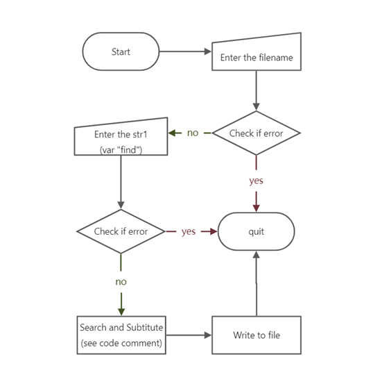
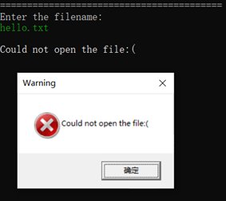
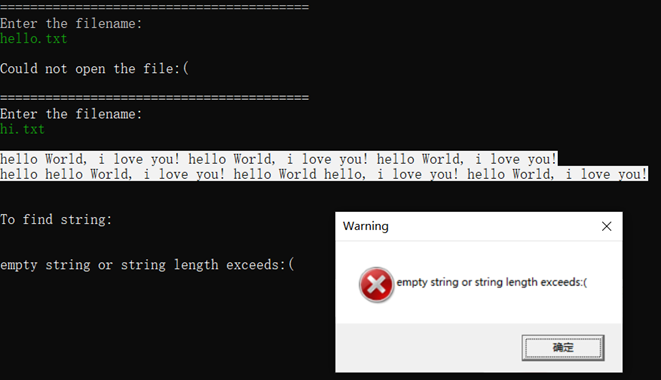

English | [简体中文](./README.md)

# Find String From `.txt` and Replace

> Translated with DeepL Translator

## Subject matter

Using PC system machine resources, program design in assembly language to find the specified string in a text file.

### Basic requirements

(1) Design an operation interface that displays prompt operations, allows input of file names, input of strings to be found, etc..
(2) Display the contents of its text file, mark the found characters or strings with different colors or blinking.
(3) Display the number found.

### Enhancement requirements

(1) A beautiful graphical interface design with friendly human-computer interaction.
(2) implementation of string replacement function to replace the found string with a user-specified string and save it.

## Main variables and data structures

|     Variable Name | Type | Variable Value | Comments                                                      |
|------------------------------|---------------|--------------------------------------|---------------------------------------------------------------|
|     handle_file              |     handle    |     ?                                |                                                               |
|     str_filename_original    |     byte      |     FILENAME_BUFFER_SIZE   DUP(0)    |                                                               |
|     str_filename_result      |     byte      |     "result.txt",0                   |                                                               |
|     original                 |     byte      |     CONTENT_BUFFER_SIZE   DUP(0)     | Strings in the original file                                  |
|     str_find                 |     byte      |     CONTENT_BUFFER_SIZE DUP(0)       | The string to find                                            |
|     str_replace              |     byte      |     CONTENT_BUFFER_SIZE   DUP(0)     | String to replace                                             |
|     result                   |     byte      |     CONTENT_BUFFER_SIZE DUP(0)       | The strings in the final new file                             |
|     set_pos_ori              |     dword     |     CONTENT_BUFFER_SIZE   DUP(0)     | Array of the starting position of each "find" string          |
|     set_pos_res              |     dword     |     CONTENT_BUFFER_SIZE DUP(0)       | Array of the starting position of each "replace" string       |
|     pos1                     |     dword     |     0                                | Tracks variable I and gives the required value to set_pos_ori |
|     pos2                     |     dword     |     0                                | Tracks variable J and gives the required value to set_pos_res |
|     count_filename           |     dword     |     ?                                | Counting the length of file names                             |
|     count_original           |     dword     |     ?                                | Count the length of strings in the file                       |
|     count_find               |     dword     |     ?                                | Count the length of strings to be found                       |
|     count_replace            |     dword     |     ?                                | Count the length of strings to be replaced                    |
|     count_result             |     dword     |     ?                                | Count the length of the strings in the new file               |
|     count                    |     dword     |     0                                | Count the number of target strings found                      |
|     i                        |     dword     |     ?                                | Translated with www.DeepL.com/Translator (free version)       |
|     j                        |     dword     |     ?                                |     ;INDEX FOR "RESULT".                                      |

## Main Algorithm Flow

The key to this project is the implementation of the string lookup algorithm.

### File reading and writing

Implemented by calling the `Win32 API` functions `CreateFile`, `ReadFile`, `WriteFile`, `CloseFile`.

### Implementation of the string lookup algorithm

To facilitate the find, we need a "pointer" to look up the string variable character by character from the beginning. We compare the characters pointed by the `original` and `find` variables, and if they are equal, we move them backwards by one at the same time; if they are not equal, the `original` pointer moves on and the `find` pointer returns to the starting position. In the whole process, each time we move the pointer, we need to check whether the pointer points to the last bit of the variable `original` or `find`.

### Implementation of string substitution algorithm

To achieve the string substitution in the enhancement requirement, the best practice is to complete the string substitution when finding the string. This is done by.

1. each time the target string is found, the traversal pointer is moved back to the beginning of the target string and the replacement string is written to the variable `result` according to the length of the replacement string.
2. when the looked-up character is not the target string, copy the character in the variable `original` that the traversal pointer points to into the variable `result`.

### Code implementation of target string highlighting

Since there is a highlighting requirement in the enhancement request, it is necessary to construct array variables `set_pos_ori` and `set_pos_res` to store the location of the target string (e.g., the first character). After the final file is saved, it is output by printing character by character, and when it reaches the position of the target string, the color of the printed text is modified by the function `SetTextColor` defined by the `Irvine` link library.

## Development Tools Configuration

Visual Studio 2019

Main libraries used: link library `Irvine32.inc`, console functions `Win32 API`

Visual Studio configuration to support assembly: 1.

1. Configure `VC++ directory`, `Linker -> General`, `Additional Libraries directory` of `Microsoft Macro Assember`, add `Irvine` folder. [Reference Link](http://t.csdn.cn/cagve)
2. Configure the `Linker -> Input` of `Additional Dependencies`, add the corresponding .lib file in the `Irvine` folder.
3. `Solution Explorer -> Project` right-click menu (right click on the project title) -> Generate dependencies -> Generate custom files -> Check MASM
4. Assembly code highlighting helper plugin (optional): AsmDude

Note 1: AsmDude may not recognize the linked libraries under the `Irvine` folder and will mark a red warning under the function, but this does not affect the normal compilation, the way to remove the warning is to manually copy the referenced linked library `.inc` from the `Irvine` folder to the same directory as `.asm` (I have done this, but in reality they do not work).

Note 2: `Irvine32` is actually a further wrapper around the `Win32 API`, `SmallWin.inc` contains the constant definitions, equivalent text, and function prototypes for the Win32 API.

## Code specification

1. the code is uniformly indented with Tab, and the Tab length is set to 5 spaces.
2. lowercase instructions in the code.
3. variable names in code are lowercase, underscored, and the first word describes the variable type.
4. code, subroutine naming uniformly begins with an underscore and lowercase.
5. comments are uniformly capitalized.
6. the functions encapsulated in the Irvine library use camel naming, and use the call instruction when calling.
7. the Win32 API functions are uniformly named with a camel and invoked with the invoke instruction.

## Test

### Sample correct input

### Special input example

#### Replace the string with a null string

#### File name error

#### Find string is empty

#### Find string not present

## Reference

### Reference materials

Assembly Language for x86 Processors 7th edition - Kip Irvine

#### Sample code for reference materials (official, with related link libraries)

[Eazybright/Irvine32](https://github.com/Eazybright/Irvine32)

#### after-school programming exercises answers (unofficial)

[tenghiz/solutions-for-parts-4-16](https://github.com/tenghiz/Assembly-Language-for-x86-processors---Kip-Irvine-solutions-for-parts-4-16-)

### Design of replacement string algorithm

[StackOverflow/assembly-replace-substring-with-another-string](https://stackoverflow.com/questions/39006495/assembly-replace-substring-with-another-string)